# Innovatefpga-AP049
[Project proposal](http://www.innovatefpga.com/cgi-bin/innovate/teams.pl?Id=AP049)

 
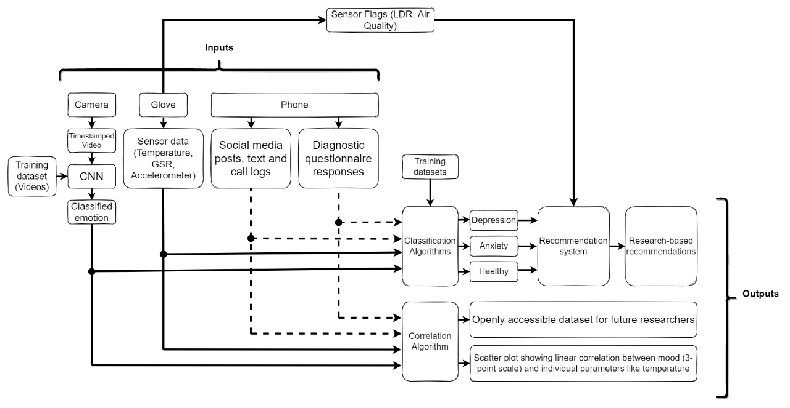 

<h1>Hardware Part</h1>
<h2>1) Sensor Integration</h2>
Qsys project for integrating sensors namely Temperature, EDA, Light, Gas Sensor. On board accelerometer integration.

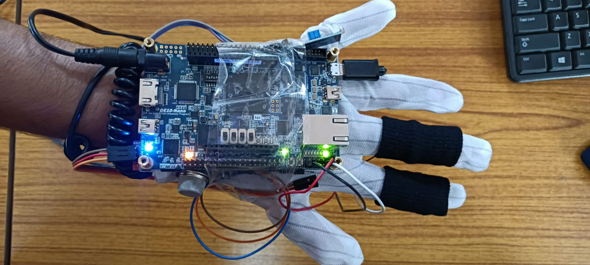
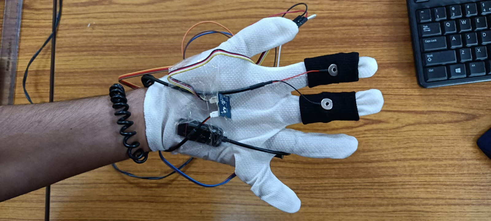

<h3>Tree</h3>

>fpga 

>>DE10_NANO_QSYS 

>>>synthesis 

>>>>submodules 

>>>>>submodule files 

>>>>debuginfo,qip,regmap and Qsys verilog files 

>>>Qsys files 

>>RemoteSystemFiles 

>>db 

>>ip 

>>>ADC_LTC2308_FIFO 

>>>>greybox_tmp 
>>>>adc verilog files 

>>script 

>>>DE10_NANO_ADC.sof 
>>>test.bat 
>>>test.sh 
>>>DE10_NANO_ADC.elf 

>>software 

>>>Eclipse files 

>>ADC top module, sopcinfo, sof, qsf and other files 

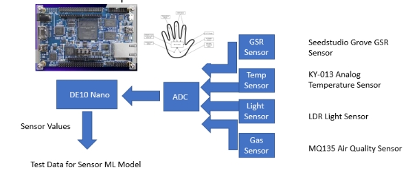

The values from the sensors are test inputs for the sensor modelling.
<h3>Plot Sensor Values</h3>

[Temperature Sensor](outputs/temp_val.png)
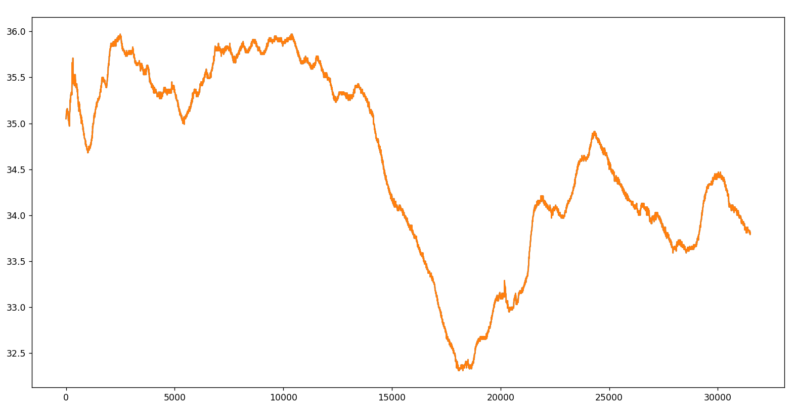
[EDA Sensor](outputs/eda.png)
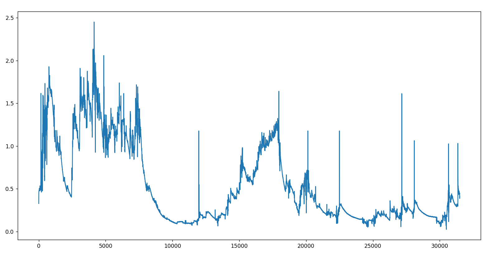

<h1>Software Part</h1>
<h2>2) Video Emotion Recognition</h2>
Videos that belong to 5 catgories namely, Angry, Anxiety, Happy, Neutral, Sad are collected from youtube, stock videos and online sites.

<h3>Tree</h3>

>Data 

>>haarcascade_frontalface_default.xml 
>>model.h5 
>>preprocessing_video.ipynb 
>>video.ipynb 
>>train 

>>>angry 
>>>anxiety 
>>>happy 
>>>neutral 
>>>sad 

>>test 

>>>angry 
>>>anxiety 
>>>happy 
>>>neutral 
>>>sad 

<h3>Preprocessing</h3>

- Sample the videos that belong to 5 classes (angry, anxiety, happy, neutral, sad) are converted to gray scale images of 48X48X1 size.
- Split data into train and test images.
- Run machine learning model.

<h3>Real Time Emotion Recognition</h3>

[Confidence](outputs/Confidence_video.png) 

[Sad](outputs/real_time_sad.jpg) 
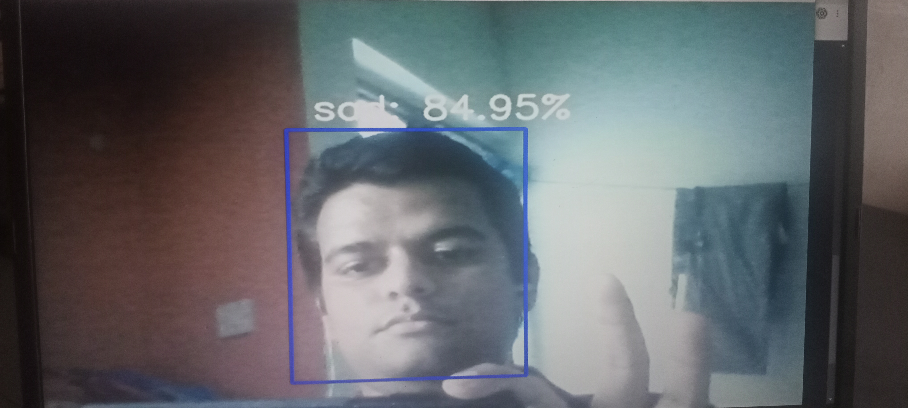 
[Happy](outputs/real_time_happy.jpg) 
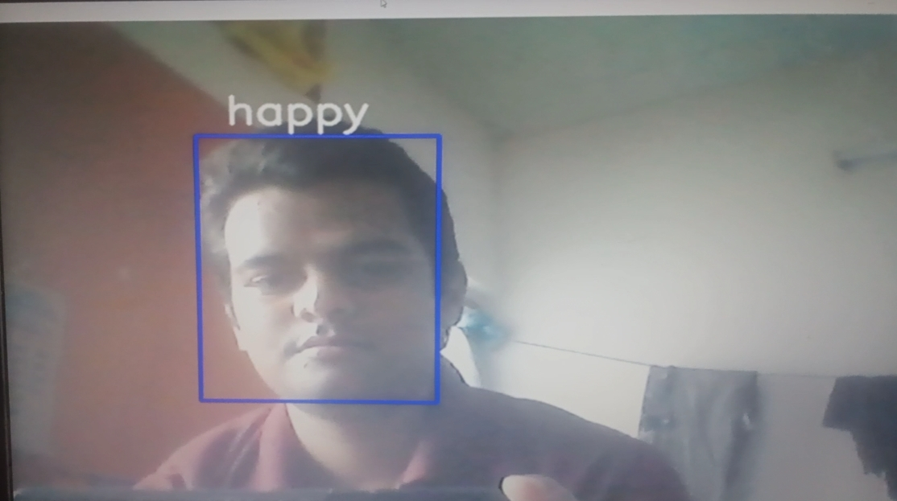 
[Anxiety](outputs/real_time_anxiety.jpg) 
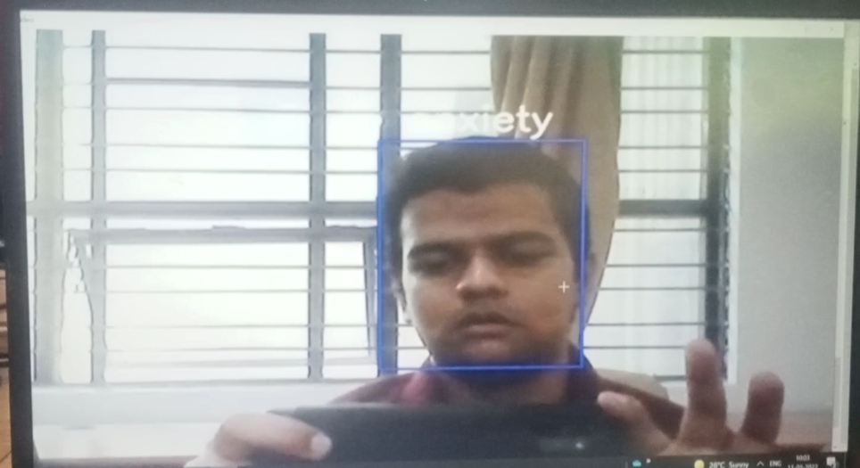 
[Angry](outputs/real_time_angr.png) 
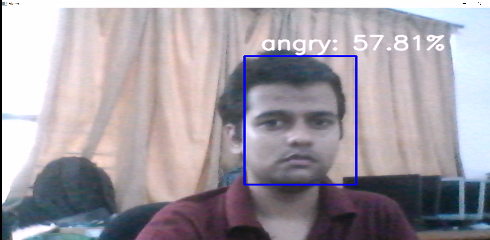 

<h2>3) Sensor Modelling</h2>

<h3>WESAD Dataset</h3>

[Link](https://archive.ics.uci.edu/ml/datasets/WESAD+%28Wearable+Stress+and+Affect+Detection%29)

<h3>Tree</h3>

>sensors 

>>LSTM_model.h5 
>>model.h5 
>>model.json 
>>sensors.ipynb 
>>dataset 

>>>WESAD 
>>>>S2 to S17 (contains .pkl, E4_Data.zip, quest.csv, readme and respiban.txt files in each folder) 

>>>WESAD.txt 

[Confidence](outputs/confidence.png) 

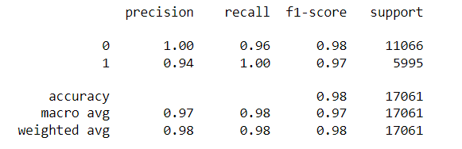 

 

Stress Prediction for Test Data 

[Stress_Prediction_100_values_of_test_data](outputs/prediction_100_values.png) 
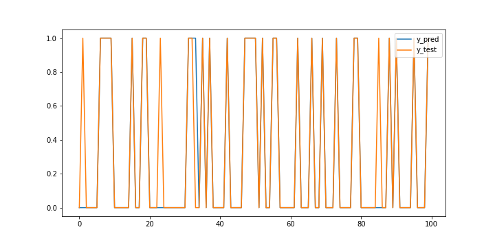 
[Stress_Prediction_200_values_of_test_data](outputs/prediction_200_values.png) 
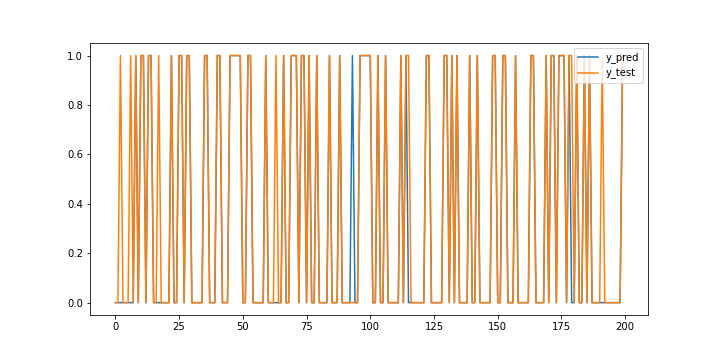 

<h1>Correlation, Classification, Mental Health Disorder Diagnosis and Recommendation</h1>

[Temperature](outputs/temp.png) 
 
[GSR](outputs/gsr.png) 
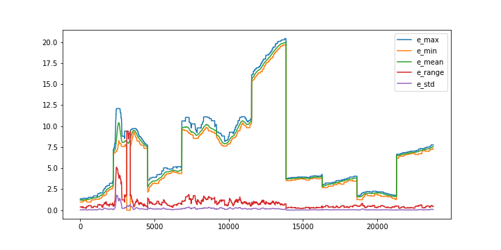 
[ACC](outputs/acc.png) 
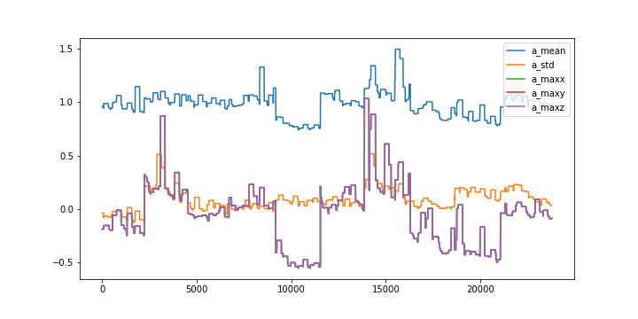 
[Correlation](outputs/corr.png) 
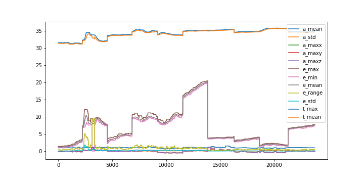 
[Real time Stress Prediction](outputs/real_time_stress_prediction.png) 
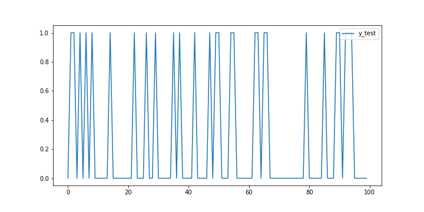 
