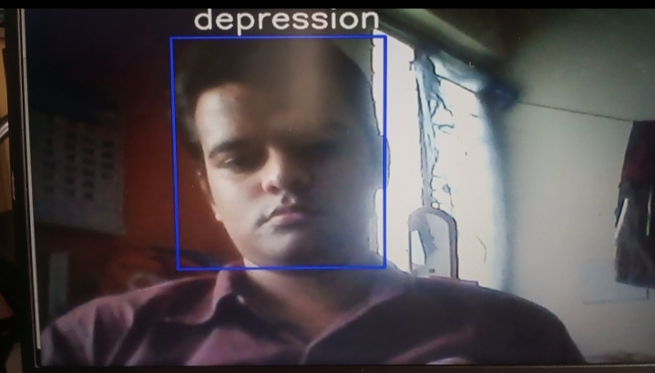

# Innovatefpga-AP049
Project for Innovatefpga contest. 
[Project proposal](http://www.innovatefpga.com/cgi-bin/innovate/teams.pl?Id=AP049)
<h2>Video Emotion Recognition</h2>
<h3>Preprocessing</h3>

<h3>Tree</h3>

>Data 

>>haarcascade_frontalface_default.xml 
>>model.h5 
>>preprocessing_video.ipynb 
>>video.ipynb 
>>train 

>>>anxiety 
>>>bipolar 
>>>dementia 
>>>depression 
>>>schizophrenia 

>>test 

>>>anxiety 
>>>bipolar 
>>>dementia 
>>>depression 
>>>schizophrenia 

- Sample the videos that belong to 5 classes (anxiety, bipolar, depression, dementia, schizophrenia) are converted to gray scale images of 48X48X1 size.
- Split data into train and test images.
- Run machine learning model.

<h3>Real Time Emotion Recognition</h3>

