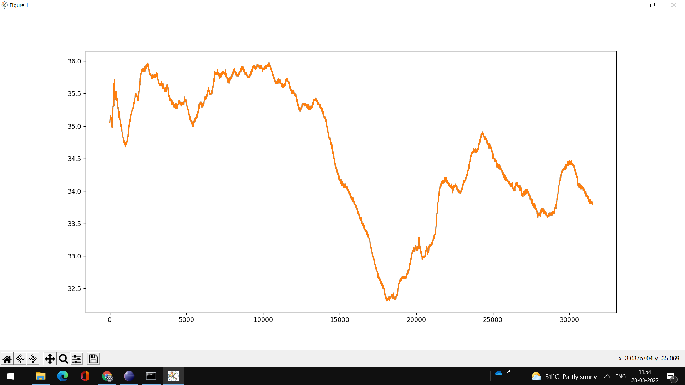
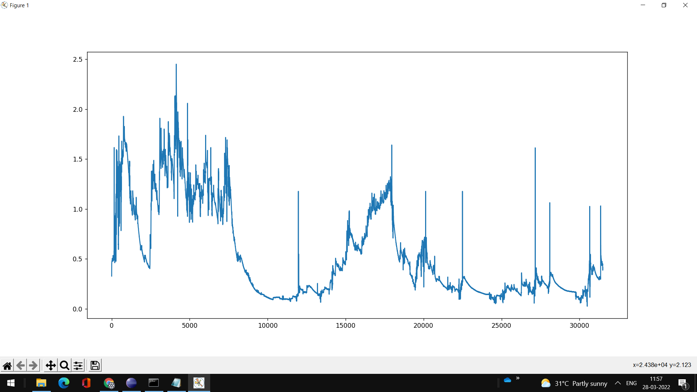

# Innovatefpga-AP049
[Project proposal](http://www.innovatefpga.com/cgi-bin/innovate/teams.pl?Id=AP049)

<h1>Hardware Part</h1>
<h2>1) Sensor Integration</h2>
<h3>Plot Sensor Values</h3>

<h1>Software Part</h1>
<h2>2) Video Emotion Recognition</h2>
<h3>Preprocessing</h3>

<h3>Tree</h3>

>Data 

>>haarcascade_frontalface_default.xml 
>>model.h5 
>>preprocessing_video.ipynb 
>>video.ipynb 
>>train 

>>>anxiety 
>>>bipolar 
>>>dementia 
>>>happy 
>>>neutral 
>>>sad 
>>>schizophrenia 

>>test 

>>>anxiety 
>>>bipolar 
>>>dementia 
>>>happy 
>>>neutral 
>>>sad 
>>>schizophrenia 

- Sample the videos that belong to 7 classes (anxiety, bipolar, dementia, happy, neutral, sad, schizophrenia) are converted to gray scale images of 48X48X1 size.
- Split data into train and test images.
- Run machine learning model.

<h3>Real Time Emotion Recognition</h3>

[Results](outputs)

<h2>3) Sensor Modelling</h2>

<h3>WESAD Dataset</h3>

[Link](https://archive.ics.uci.edu/ml/datasets/WESAD+%28Wearable+Stress+and+Affect+Detection%29)

<h3>Tree</h3>

>sensors 

>>LSTM_model.h5 
>>model.h5 
>>model.json 
>>sensors.ipynb 
>>dataset 

>>>WESAD 
>>>>S2 to S17 (contains .pkl, E4_Data.zip, quest.csv, readme and respiban.txt files in each folder) 

>>>WESAD.txt 

<h1>Correlation, Mental Health Disorder Diagnosis and Recommendation</h1>

