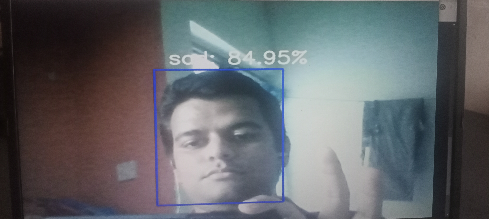
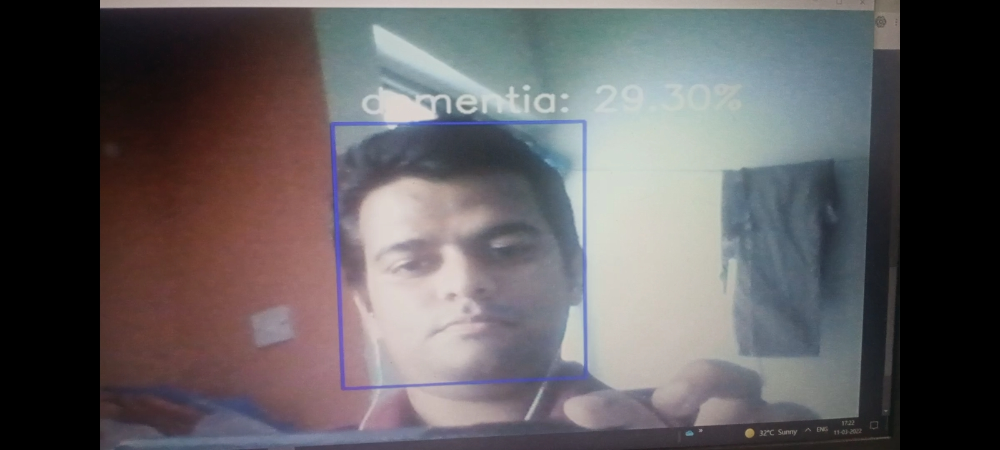
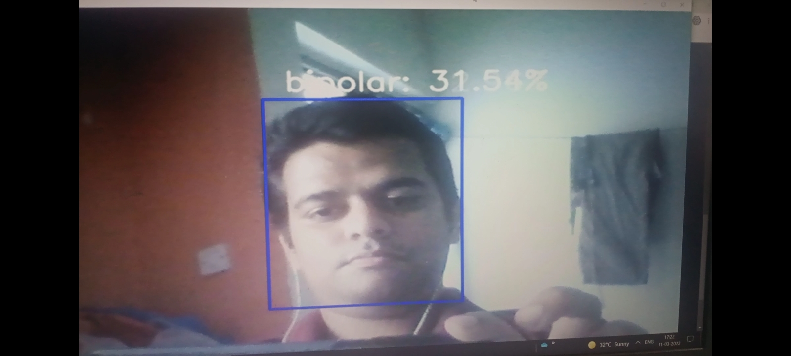

# Innovatefpga-AP049
Project for Innovatefpga contest. 
[Project proposal](http://www.innovatefpga.com/cgi-bin/innovate/teams.pl?Id=AP049)
<h2>Video Emotion Recognition</h2>
<h3>Preprocessing</h3>

<h3>Tree</h3>

>Data 

>>haarcascade_frontalface_default.xml 
>>model.h5 
>>preprocessing_video.ipynb 
>>video.ipynb 
>>train 

>>>anxiety 
>>>bipolar 
>>>dementia 
>>>happy 
>>>neutral 
>>>sad 
>>>schizophrenia 

>>test 

>>>anxiety 
>>>bipolar 
>>>dementia 
>>>happy 
>>>neutral 
>>>sad 
>>>schizophrenia 

- Sample the videos that belong to 7 classes (anxiety, bipolar, dementia, happy, neutral, sad, schizophrenia) are converted to gray scale images of 48X48X1 size.
- Split data into train and test images.
- Run machine learning model.

<h3>Real Time Emotion Recognition</h3>

[Sad](outputs/real_time.jpg)

[Schizophrenia](outputs/real_time_schizophrenia.jpg)

[Dementia](outputs/real_time_dementia.jpg)

[Bipolar](outputs/real_time_bipolar.jpg)

[Happy](outputs/real_time_happy.jpg)

[Anxiety](outputs/real_time_anxiety.jpg)

<h2>Audio Emotion Recognition</h2>

<h2>Sensor Modelling</h2>

<h3>WESAD Dataset</h3>

[Link](https://archive.ics.uci.edu/ml/datasets/WESAD+%28Wearable+Stress+and+Affect+Detection%29)

